High schooler in California building web apps and AI tooling. Mostly TypeScript, React, and Next.js; some Python. Pine Script on the side.

### Projects

- [**Ascenta 3**](https://github.com/SaarthurR/ascenta3) — session-gated arcade portal: access-key login, HMAC-signed sessions verified at the edge · [live](https://ascenta3.vercel.app)
- [**Diggity**](https://github.com/SaarthurR/Diggity) — snap an artifact, GPT-4o vision returns a structured dossier: name, era, civilization, significance
- [**Outreach CRM**](https://github.com/SaarthurR/outreach-crm-dashboard) — lead discovery, AI-drafted emails, Gmail sending, and reply tracking via Pub/Sub
- [**Juber**](https://github.com/SaarthurR/Juber) — carpool board for a temple community: post and find rides, realtime seat coordination
- [**physics**](https://github.com/SaarthurR/physics) — interactive Physics 7C study site with a built-in AI tutor · [live](https://physics7c.vercel.app)

### Reach me

[saarth-site.vercel.app](https://saarth-site.vercel.app) · [ranka.saarth@gmail.com](mailto:ranka.saarth@gmail.com)

<picture>
  <source media="(prefers-color-scheme: dark)" srcset="https://raw.githubusercontent.com/SaarthurR/SaarthurR/output/github-snake-dark.svg" />
  
</picture>
